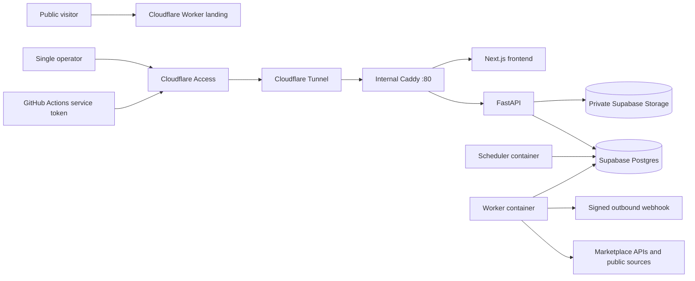

# V0.15 Architecture

## Runtime Boundaries

- The public Worker contains marketing content and a link to the private app; it does not run the product backend.
- Cloudflare Access authenticates the operator and adds a signed JWT. FastAPI verifies issuer, audience, signature, and operator email.
- Cloudflare Tunnel is the only HTTP ingress. Caddy, Next.js, FastAPI, worker, and scheduler are private Docker-network services.
- Supabase/Postgres is the source of truth for products, prices, evidence metadata, strategies, signals, notifications, and jobs.
- Supabase Storage holds private uploaded evidence. Service-role credentials exist only in backend containers.
- Long operations are queued in PostgreSQL and claimed with `FOR UPDATE SKIP LOCKED`; API requests return without waiting for crawling or report generation.

## Trust Layers

1. Market facts: crawler and provider records remain `VISIBLE_PRICE` or `UNVERIFIED`.
2. Verification: an operator uploads checkout/cart/order evidence; the server stores it, hashes it, and records provenance.
3. Strategy: only fresh `VERIFIED_CHECKOUT` records with trusted uploaded evidence and matching currency can trigger.
4. Notification: a new triggered signal creates a durable in-app notification and optional signed webhook delivery.

Selection scores may use clues, but selection scores never become executable strategy signals.
